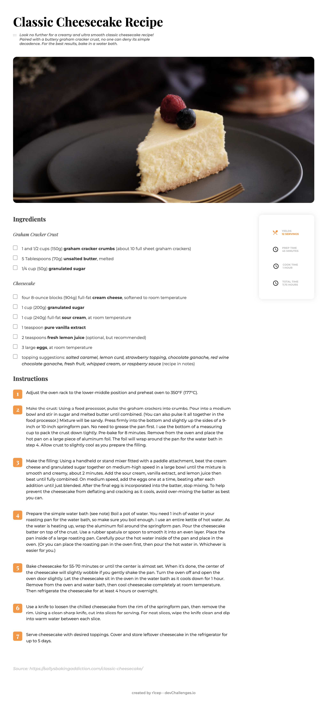
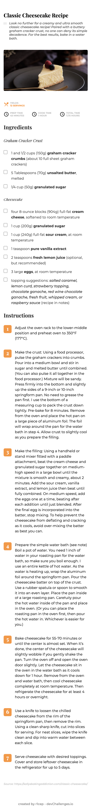

<!-- Please update value in the {}  -->

<h1 align="center">Recipe page</h1>

<div align="center">
   Solution for a challenge from  <a href="http://devchallenges.io" target="_blank">Devchallenges.io</a>.
</div>

<div align="center">
  <h3>
    <a href="https://r1cep.github.io/dev-challenges-recipe-page/">
      Demo
    </a>
    <span> | </span>
    <a href="https://github.com/r1cep/dev-challenges-recipe-page">
      Solution
    </a>
    <span> | </span>
    <a href="https://devchallenges.io/challenges/OEKdUZ6xs0h99C38XVht">
      Challenge
    </a>
  </h3>
</div>

<!-- TABLE OF CONTENTS -->

## Table of Contents

- [Table of Contents](#table-of-contents)
- [Overview](#overview)
  - [Desktop](#desktop)
  - [Mobile](#mobile)
  - [Built With](#built-with)
- [Features](#features)
- [How To Use](#how-to-use)
- [learned/improved](#learnedimproved)
- [Acknowledgements](#acknowledgements)
- [Contact](#contact)

<!-- OVERVIEW -->

## Overview

### Desktop



### Mobile



### Built With

<!-- This section should list any major frameworks that you built your project using. Here are a few examples.-->

- [HTML: HyperText Markup Language | MDN](https://developer.mozilla.org/ja/docs/Web/HTML)
- [CSS: カスケーディングスタイルシート | MDN](https://developer.mozilla.org/ja/docs/Web/CSS)
- [Node.js](https://nodejs.org/ja/): 18.7.0
- [Vite | 次世代フロントエンドツール](https://ja.vitejs.dev/): 3.0.7
- [Sass: Syntactically Awesome Style Sheets](https://sass-lang.com/): 1.54.8

## Features

<!-- List the features of your application or follow the template. Don't share the figma file here :) -->

This application/site was created as a submission to a [DevChallenges](https://devchallenges.io/challenges) challenge. The [challenge](https://devchallenges.io/challenges/TtUjDt19eIHxNQ4n5jps) was to build an application to complete the following user stories:

- [x] User story: I can see a recipe with ingredients and instructions
- [x] User story: I can select a checkbox if I have the ingredients
- [x] User story: I can see the number of servings, baking times

## How To Use

To clone and run this application, you'll need [Git](https://git-scm.com) and [Node.js](https://nodejs.org/en/download/) (which comes with [npm](http://npmjs.com)) installed on your computer. From your command line:

```bash
# Clone this repository
$ git clone https://github.com/r1cep/dev-challenges-recipe-page

# Install dependencies
$ pnpm i

# Run the app
$ pnpm dev
```

## learned/improved

- Using a grid layout
- How to style the number of list

## Acknowledgements

<!-- This section should list any articles or add-ons/plugins that helps you to complete the project. This is optional but it will help you in the future. For exmpale -->

- [【HTMLで箇条書き】ul・ol・liタグの使い方まとめ](https://saruwakakun.com/html-css/basic/ul-ol-li)
- [コピペで使えるリストデザイン34選：CSSで箇条書きをおしゃれに](https://saruwakakun.com/html-css/reference/ul-ol-li-design)

## Contact

- GitHub [@r1cep](https://github.com/r1cep)
